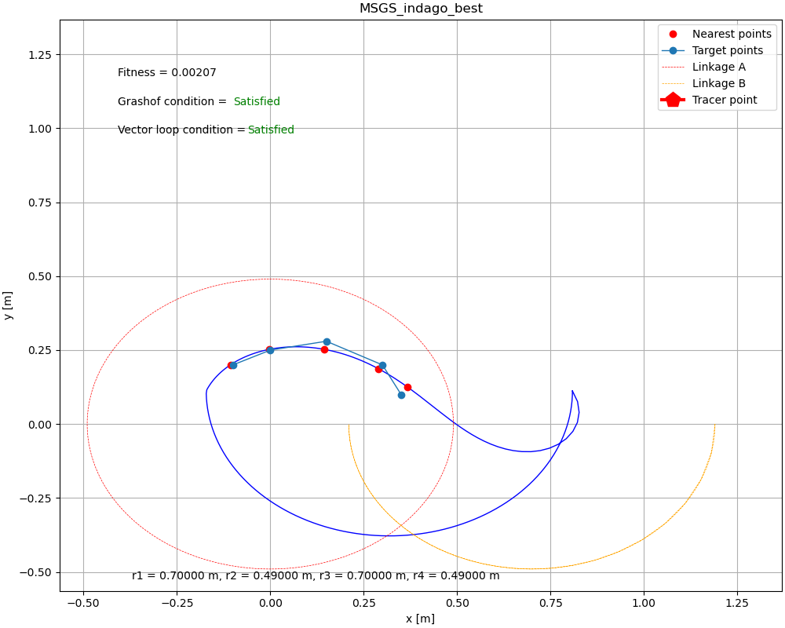

# Fourbar Mechanism Optimization

**Fourbar Mechanism Optimization**



## Overview

Fourbar Mechanism Optimization is a project dedicated to enhancing the performance of four-bar linkages by optimizing the lengths of their constituent linkages. This project employs a variety of optimization techniques to achieve specific performance objectives.

## Optimization Methods

The project leverages multiple optimization methods to improve the operation of four-bar mechanisms. These methods include, but are not limited to:

- Nelder Mead
- MSGS (Multi-Scale Grid Search)
- L_BFGS_B (Limited-memory BFGS)


## Required Libraries

To get started with this project, make sure you have the following Python libraries and dependencies installed:

- [NumPy](https://numpy.org/): A library for numerical computations.
- [SciPy](https://www.scipy.org/): A library for scientific and technical computing.
- [Matplotlib](https://matplotlib.org/): A library for creating visualizations.
- [Indago](https://pypi.org/project/Indago/): A library for optimization methods (please provide the link).

You can install these libraries using `pip` or your preferred package manager:

```bash
pip install numpy scipy matplotlib indago
